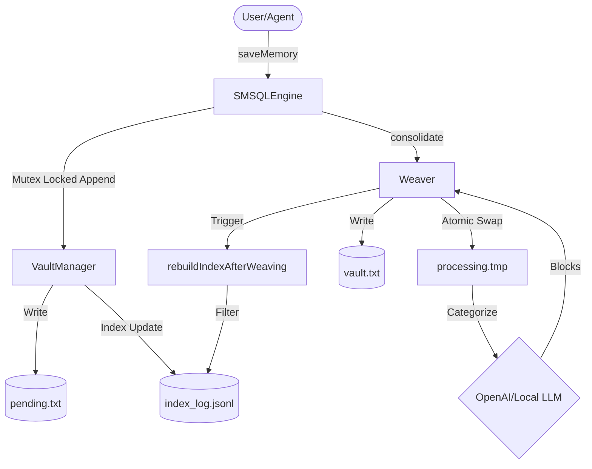

# SM-SQL Core: Architectural Blueprint (v1.1.0-alpha)

## Overview: The "Hippocampus" for Autonomous Agents

SM-SQL Core is a local-first, high-performance RAG (Retrieval-Augmented Generation) engine designed to serve as the long-term memory system for autonomous AI agents like Airi. It prioritizes ultra-low latency, data integrity, and a "Zero-Binary" footprint.

---

## 1. Core Principles & v1.1.0 Breakthroughs

### Zero-Binary Philosophy
The engine is built entirely on native Node.js APIs (`fs`, `path`). It avoids heavy-weight database binaries (SQLite, PostgreSQL) in favor of **Append-Only Logs** and a **Fuzzy Memory Index**. This ensures maximum portability, sub-millisecond local I/O, and extreme reliability under high-frequency writes.

### Atomic Handshake (Synchronization)
A critical P0 technical debt resolved in v1.1.0 was the **Index Corruption Bug**. During the transition from System 1 (Pending Logs) to System 2 (Consolidated Vault), the memory index would often hold dangling pointers to old byte offsets in the cleared `pending.txt`.

**The Solution: `rebuildIndexAfterWeaving(ignoreBeforeTs)`**
1. **Consolidation Start**: `Weaver` captures a `startTime` and renames `pending.txt` to a temporary processing buffer.
2. **LLM Processing**: The AI consolidates logs asynchronously. During this window, the agent can still write *new* memories to a fresh `pending.txt`.
3. **Atomic Handshake**: Once the `vault.txt` is updated, `VaultManager` filters the `index_log.jsonl`. It drops all "Pending" entries created *before* the consolidation start time while preserving the newly written logs and the updated Vault coordinates.

### API Facade Pattern
To support seamless Agent Tool-calling, the API has been decoupled from internal structures:
- **Semantic Mapping**: Public methods use `MemoryType` ('core' | 'preference' | 'short-term') instead of internal `BlockClass` enums.
- **DTO-First Design**: `searchMemoriesAdvanced` returns a flat array of `MemoryBlockDTO[]`, providing the agent with immediate access to `content`, `tags`, and a relevance `score`.

---

## 2. Physical File Map

| **`SMSQLEngine.ts`** | **Facade Layer**: Aggregates Retriever, Weaver, and VaultManager into a single, clean public API. Supports **Atomic Tag Updates**. |
| **`vault.ts`** | **Storage Engine**: Manages physical files (`pending.txt`, `vault.txt`) and the Append-Only `index_log.jsonl`. Implements `AsyncMutex` for concurrency safety. |
| **`AiriMemoryAdapter.ts`** | **Cognitive Firewall**: Enforces session isolation, prevents token overflows, and implements defensive prompt wrapping. |
| **`retriever.ts`** | **System 1 (Reflex Arc)**: High-speed fuzzy search using Levenshtein distance over the Tag Graph. Handles score accumulation and recency weighting. |
| **`weaver.ts`** | **System 2 (Deep Cortex Lite)**: Orchestrates LLM-driven categorization and consolidation of raw conversation logs into semantic blocks. |
| **`types.ts`** | **Common Schema**: Definition of the Shadow Index, Block Classes, and DTOs. |

---

## 3. Cognitive Integrity & Lifecycle

### Memory Firewall (AiriMemoryAdapter)
The adapter acts as the ultimate safeguard for Airi's cognitive pipeline:
- **Hard Session Boundary**: Uses prefixing (`sys:session:${id}`) to ensure no data leakage between conversations.
- **Instruction-Follower Defense**: Wraps retrieved context in a structured, untrusted header to prevent prompt injection.

### Lifecycle Tools
V1.1.0-RC2 introduces advanced memory pruning and evolution tools:
- **Supersede Tool**: Allows the agent to "evolve" a memory. The old block is soft-invalidated with `sys:state:superseded`, and a new, more accurate block is stored.
- **State Management**: Supports `active`, `stale`, and `superseded` states via atomic tag updates.
- **State Filtering**: The retrieval path automatically filters out non-active memories, ensuring Airi only converses based on the current "ground truth".

---

## 4. Data Flow & Concurrency

---

## 4. Future Blueprint: Hybrid Cognitive Architecture

The SM-SQL roadmap evolves into a three-plane cognitive system for Airi:

### Plane 1: System 1 (Reflex Arc) - *Active Now*
- **Latency**: <10ms
- **Mechanism**: Current Tag Graph + Keyword Blitz.
- **Goal**: Instant conversational context and immediate fact recall.

### Plane 2: System 2 (Deep Cortex) - *Coming Soon*
- **Latency**: 2s - 5s
- **Mechanism**: Sirchmunk-style Agentic Search. An LLM "Search Agent" will perform Monte Carlo sampling over raw logs, refining queries based on initial hits.
- **Goal**: Complex reasoning, identifying long-term behavioral patterns, and multi-hop memory retrieval.

### Plane 3: System 3 (Dream Consolidation) - *Coming Soon*
- **Latency**: N/A (Offline/Background)
- **Mechanism**: Offline background jobs using high-reasoning models (o1/o3).
- **Goal**: Lossy compression (garbage collection), memory de-duplication, and "Insight Discovery" (generating new 'core' memories from high-frequency behaviors).

---
*SM-SQL Core v1.1.0-alpha - Optimized for the next generation of autonomous intelligence.*
